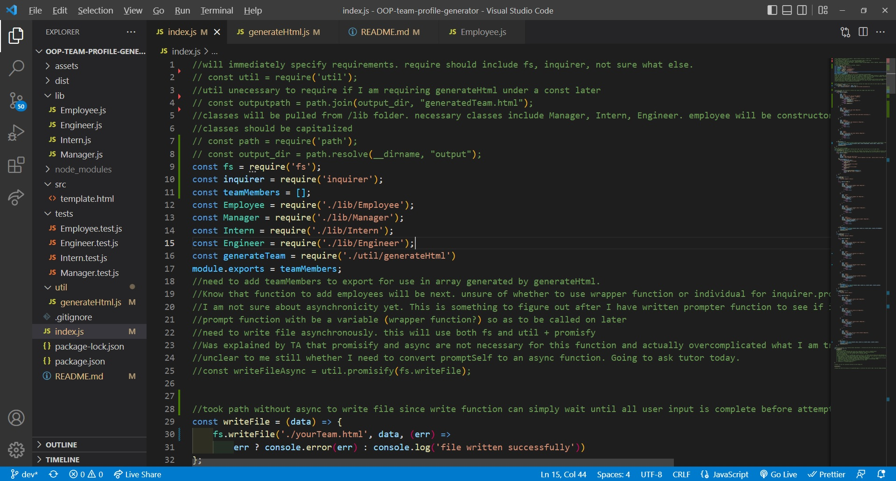
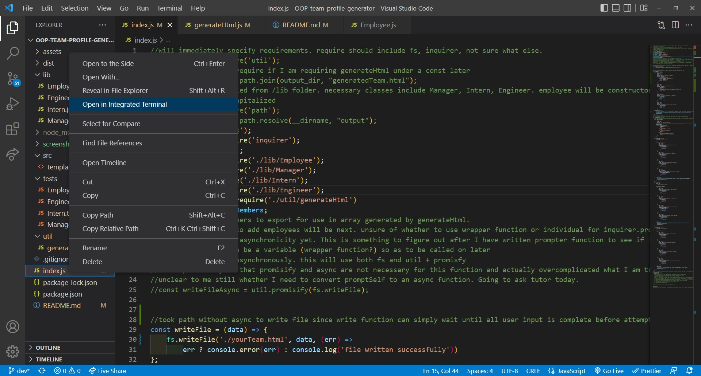
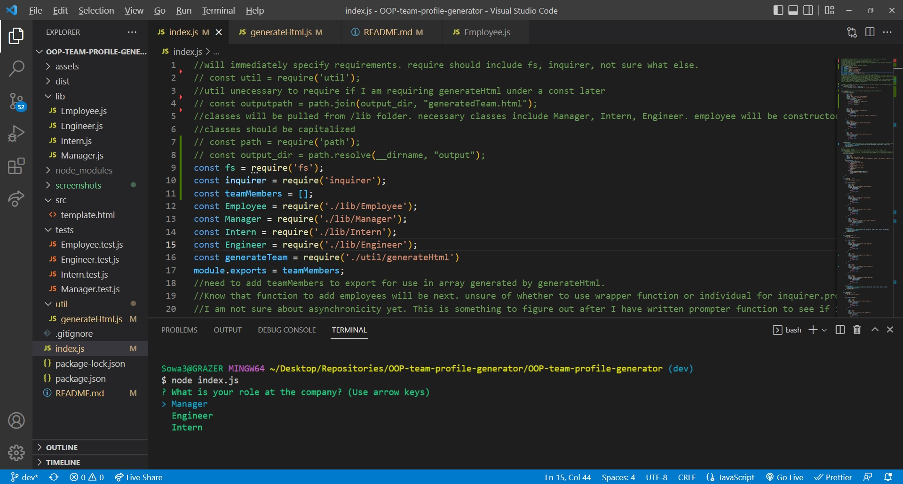
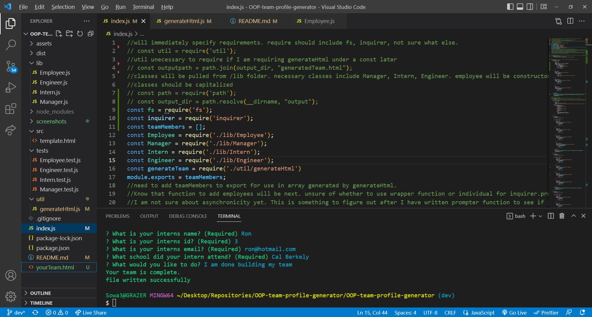
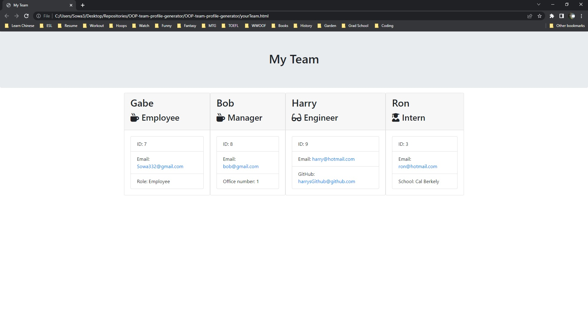

# OOP-team-profile-generator

## Video Walkthrough Link https://drive.google.com/file/d/15nS4FteYlbf63dtKkKVCFZ4hT8OhClmU/view

## Table of Contents

- [Description](#description)
- [Installation](#installation)
- [Usage](#Usage)
- [Bugs](#Bugs)
- [Screenshots](#screenshots)
- [Credits](#credits)

## Description

This project involved creating a terminal app that would execute via inquirer in the command line interface in order to generate an HTML file displaying fictional employee data.

- The motivation for creating this project was continuing to develop node.js skills that integrate traditional javascript with the node runtime environment in order to build unique apps, generate individual data or files, and allow for dynamic user input in the command line prompt. The primary new element of learning here is the OOP (Object-Oriented-Programming) paradigm; this is not so much a specific JavaScript function as it is a pattern and template of coding that enables better data sharing across large swaths of files.
- I built this project largely in order to continue to get practice with the skills we are working on in class. OOP is a difficult concept to transition to, and it was especially difficult for me to grasp constructor classes, supers, and extensions. In addition, I had to learn how jest npm and testing object methods worked, which was an additional learning curve. This project was a painful experience that showed me learning OOP is not easy for everyone- especially me. This is something to keep working on into the future.
- This is a useful project in that it enables a user to generate a live HTML file based on input from the command line. This project is a model for how one can use inquirer, jest, and other npms to dynamically generate correct data in a runtime environment outside of the browser. Theoretically, on the user-end, this project could enable someone to record vital data on employees within a given company. Should the company be changing or the user want to update data on one or more of the company employees, they can simply run the inquirer prompt to generate a new HTML file with corresponding data due each employee of each class (in this case, the employee themselves, the manager, an intern, and an engineer).
- This project represented an incredible jump in difficulty and learning curve that I have not fully overcome. While other projects like the weather dashboard, password generator, and read-me generator involved rendering dynamic information through JavaScript, none required me to understand object-based methodology as deeply as this one did (or even to understand objects in JS well at all). Thus, this project represents a forward step to deeply appreciating what JavaScript is capable of in terms of rendering data and responding to user input by better reconiciling the need for complex object structures with clean user interfacing and input methodologies.

## Installation

- Running this node requires inquirer and jest, two npms listed as dev dependencies in package.json. These npms can be installed easily via the command line by entering 'npm install -----" (it can be important to list the version # as well; in this case, v8).

## Usage

- In order to utilize this project, the user should expect to work from within the command line in a node. After opening an integrated terminal within the OOP Team Generator folder, they can run 'node index.js' and begin inquirer prompts. The user follows a series of prompts that will assume they work at a company with several roles (including asking their own role, which will auto fill as employee). Once the user is finished entering information about themselves and their coworkers, an html file named 'yourTeam.html' will be generated. This html file will display parameters for each employee input by the user in the command line prompt.

## Bugs

- There are no known major bugs afflicting the program. However, the initial prompt called lines 38-52 that asks the user for their role at the company is not functioning correctly. The inquirer prompts will proceed regardless of what is entered, and user input on their own role does not change their employee card generated in the final html.

## Screenshots

- 
- 
- 
- 
- 

## Credits

- This project could not have been completed without the hardwork and excellent advice of my educators at UW Fullstack and tutor, Jacob Carver.
